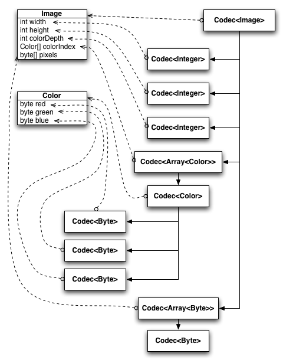
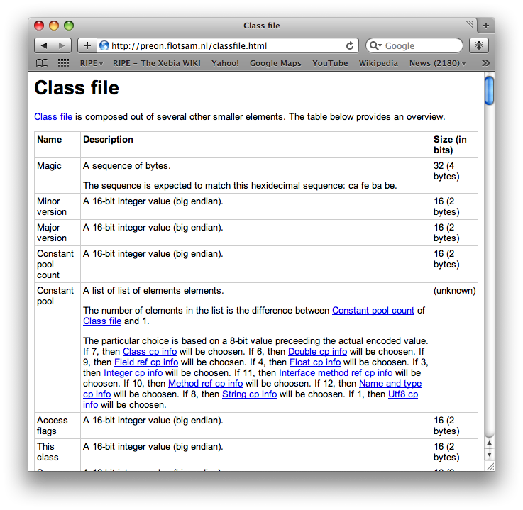

= Preon: Bit Syntax for Java
Wilfred Springer
April 24, 2009

== Introduction

Contrary to popular widespread believe, only a fraction of the data stored on disk and traversing the network is encoded in XML.
A significant portion of the data floating around on the Internet is encoded using an abundance of compression techniques, often relying on data being encoded in a number of bits rather than a number of bytes. 

This paper introduces Preon, a framework addressing the challenges for writing software dealing with binary encoded data. 

== Challenges

Writing software capable of dealing with these media formats is not trivial, for various reasons: 

* Not trivial because of the abundance of compression techniques available and in use; 
* Not trivial because of the inter-dependencies between various parts of the encoded representation; 
* Not trivial because of resource constraints; 
* And related to that, not trivial because of the need often present to pull data in _only_ on demand. 

As a consequence of these complications, most software responsible for encoding and decoding binary encoded data is notoriously hard to maintain.
In most cases, knowledge about the encoding format is replicated in both the decoder, the encoder _and_ in the documentation. 

== Preon Summarized

Preon is a framework for dealing with bitstream compressed data, addressing the concerns outlined above.
Preon originated from an attempt to restructure the way to deal with map files and other compressed file formats in use at TomTom. 

Preon's scope and ambitions can be summarized like this: 

* Preon allows you to capture__intent__. 
* Preon allows you to capture the _format of the encoded representation _ unambiguously in declarative way. 
* Preon allows you to capture the mapping between the encoded representation and the in-memory data structure. 
* Preon uses the meta data outlined above to build a codec for decoding the data. 
* Preon uses the meta data to generate hyperlinked human-readable documentation on the encoded representation. 

== Preon's Bitstream Structure Description Language

Unlike some of the other approaches that have been taken towards this problem (see<<_section_languages>>), Preon does _not_ rely on XML or a DSL to capture the specifics of a format.
Instead, it relies on annotations on the classes defining the runtime representation of the encoded representation. 

Suppose there is a need to capture how a certain color is encoded in some graphical file format, and let us assume that the RGB components are values ranging from 0 to 255.
Then based on that simple model, <<_example_color>> illustrates how you would specify the structure of that format, and how it maps to your in-memory data representation. <<_example_decode>> illustrates how you would use this 'specification' to decode a color from a byte array. 

.Simple Example
====
[source]
----
class Color {
@Bound byte red;
@Bound byte green;
@Bound byte blue;
}
----
====

.Decoding Color
====
[source]
----

Codec<Color> codec = Codecs.create(Color.class);
Color color = codecs.decode(codec, new byte[] { 0x33, 0x22, 0x11 });
----
====

Preon supports the notion of convention over configuration.
By default, a byte that is marked as @Bound will be decoded based on the most natural approach you would expect for decoding a byte: take 8 bits from the bitstream, and assume that to be the signed representation of the byte you're expecting to read.
Similarly, an @Bound annotation on a boolean field will cause the boolean to be decoded based on a single bit. 

There may and _will_ however be cases in which these defaults are not the proper way to go.
In some cases, you might expect the byte to be encoded in four bits only, for instance.
In order be more specific on how values should be decoded, Preon allows you to use more specific annotations. 

<<_example_color_collection>> illustrates a situation in which specifying more meta data is required.
It involves collection of colors, in which the format allocates two bytes for the number of colors in the collection, and an array of colors that holds the definitions of these colors. 

.Color collection
====
[source]
----
class ColorCollection {
@BoundNumber(size="16") int nrColors;
@BoundList(size="nrColors") Color[] colors;
}
----
====

<<_example_color_collection>> not only illustrates the use of more specific annotations, it also illustrates that Preon allows you to define dependencies between different data elements: the length of the colors array is based on the number of colors provided by nrColors. 

== Preon Expressions

The size attribute on @BoundList in <<_example_color_collection>> is interpreted as a Limbo footnote:[See.] expression.
Applied in this context, the expression language not only allows you to refer to data previously read in that same data structure, but it also allows you point to the outer context (for inner classes), to items of collections, and to properties of objects.
Limbo allows you to build expressions by combining these references and literal values using logical and arithmetic operators. 

Limbo has been designed specifically for Preon.
Its support for early binding is used when building Codecs for a certain data element; if expressions contain invalid references, this will be discovered during the construction of the Codec, _before_ using the Codec to decode a piece of data. 

The early binding capability is not the only difference between Limbo and other expression language libraries existing in the Java space.
Another difference is its support for producing a human-readable translation of the expression.
Preon's support for generation documentation from a Codec relies heavily on this capability. 

== Preon Codecs

The Codec constructed as illustrated in <<_example_decode>> not only allows you to decode a binary representation of the runtime representation of the data structure; it _also_ captures everything known about that data structure.
In fact, it is only capable of decoding the binary encoded representation as a consequence of the fact that it captures all meta data of the binary encoded representation. 

Preon does not generate any source code or byte code.
That means that - rather than generating a one-of Codec - the Codec is _assembled_ at runtime from smaller Codecs, each with their own limited responsibility. 

In<<_example_color>>, the Codec constructed from the Color class is an ObjectCodec that delegates to three instances of NumberCodec.
The ObjectCodec understands the relationship between the object's attributes and the Codecs required to decode data into those attributes. 

The Codec constructed from the other example (<<_example_color_collection>>) is an ObjectCodec that delegates to a NumberCodec and a ListCodec.
The ListCodec in turn relies on an ObjectCodec for Color instances, which - as we have seen before - relies on three NumberCodecs to decode the bytes representing the RGB components of that color. 

<<_fig_codec>> depicts the relationship between the the classes representing a data structure at runtime, and the Codecs responsible for decoding the data from its binary encoded representation. 

.Codecs Linked to Data Structure

Creating Codecs this way has a number of important benefits.
The most important benefit is that it makes the framework extensible.
Codecs that delegate to other Codecs do not need to have deep insight into the specifics of the Codecs they are targeting.
The Codec interface is fairly simply, and really abstract.
If in the future, there would be other types of Codecs to delegate to (Codecs that would decode data using compression techniques not yet known today), then the governing Codec does not need to know about the specifics in order to use that new type of Codec it's delegating to.
(See also<<_section_flavor>>.) 

== Preon Documentation

Given the fact that Preon captures all meta data known on a file format into a tree of Codecs, it is also capable of leveraging that meta data to generate documentation on the file format.
And, as with decoding the data, the process of building documentation is broken apart and delegated to each individual Codec that is part of the chain of responsibility hanging of the top level Codec. 

Basically, when requesting documentation based on a certain Codec (see<<_example_build_documentation>>), the process will figure out how to best organize the document, and then give every Codec the change to render itself in the most appropriate way. 

.Building documentation
====
[source]
----
Codec<Color> codec = Codecs.create(Color.class);
Codecs.document(codec, DocumentType.Html, new File(...));
----
====

<<_fig_documentation>> illustrates the hyperlinked HTML output of a call to Codecs.document(...). In this particular case, it shows an excerpt of the documentation generated from a Preon description of Java's class file format footnote:[The full documentation can be downloaded from.] . 

.Documentation on Java's class file Format

[[_section_languages]]
== Bitstream Structure Description Languages

Preon is not the first attempt to capture bitstream structure in a formal way.
There are a number of initiatives working in a similar direction.
This paper is not aiming at providing a full overview of all of these other initiatives.
It will only highlight some of them, in order to illustrate the differences with the approach Preon is taking. 

[[_section_flavor]]
=== Flavor

Flavor <<_bib_flavor_1>> offers a DSL for defining the structure of a bitstream.
The tool-chain rewrites specifications written in this DSL into C++ and Java sources for both the decoding and encoding logic, as well as the classes capable of capturing the data structures encoded in the bitstream.
Data will be decoded in a single pass, and the entire data structure needs to fit on the heap. 

Flavor was one of the solutions originally considered when searching for an alternative solution for decoding TomTom map files.
Unfortunately, Flavor is not extensible; it is impossible to add support for other compression techniques without rewriting the code generator that takes Flavor input and produces Java / C++. 

Preon allows you to extend its support for compression techniques by implementing a number of interfaces, and registering these extensions with the framework at runtime.
The extensions may be triggered by annotations, particular data types, or by combinations of annotations and particular data types. <<_example_extension>> illustrates a situation in which an extension is triggered by a new annotation introduced by the extension.
Note how the framework supports using the new annotation in combination with other, predefined annotations. 

.Potential Extension
====
[source]
----
@BoundHuffmanCoded(...) String name;
@Bound boolean isCity;
----
====

Flavor's processing model also turned out to be problematic for processing map data.
Flavor is only capable of reading the entire data structure into memory in a single pass.
All of the map data in a 1.5 GB map file would - once uncompressed - be much larger than feasible. 

Preon will _not_ read the entire data structure in a single pass.
By default, it will determine which parts of the data structure can be loaded lazily, and then choose to do so.
The paradigm is closer to random access than streaming. 

Last, but not least, when examining Flavor for use on map files, it turned out that the API constructed by it is not threadsafe.
Preon can be accessed by multiple threads, in case the data is read from a ConcurrentBitBuffer that it it shipping. 

=== Erlang Bit Syntax

The Erlang programming language has support for bitstream structure descriptions built into the language<<_bib_erlang_bit_syntax>>.
The actual description is specified as a pattern, which can then - using Erlang's pattern matching syntax - be used to break a bitstream apart into its different constituents, and stored in the corresponding variables. 

Although Erlang's bit syntax is powerful, and its tight integration with the language is a bless, it also has limitations.
First of all, it most well fit for flat data structures, without any nesting or interdependencies between different data elements read.
In case of more complicated data structures, Erlang's bit syntax is still a convenient tool, but it _will_ require writing some imperative code to deal with the complexity. 

Preon supports a wider range of data structures out of the box.
However, given the huge number of compression techniques out there, it will not be enough to cater for every existing encoding format.
In order to deal with that, Preon offers its extension points, allowing you to make your own extensions as well supported as the encoding techniques supported out of the box. 

=== BSDL, XFlavor, BFlavor, gBFlavor

XFlavor <<_bib_xflavor>> is an extension of Flavor, supporting XML features.
It takes the Flavor syntax of a bitstream structure description, and turns it into XML.
The MPEG-21 Bitstream Syntax Description Language is a tool of the MPEG-21 specification, to assist in customizing scalable bitstreams.
BFlavor and gBFlavor combine these different technologies. 

Although all of these technologies address problems in the same space as Preon, the emphasis seems to be on streaming data, and the approach is quite different than Preon's.
There seems to be an emphasis on using XML in all of these technologies.
Preon opted for capturing the bitstream syntax description in a programming language, to avoid having to generate source code, and to be able to not only capture meta data on a particular encoding technique, but also its behaviour. 

=== Other Data Binding Frameworks

Although Preon is clearly targeting a different on disk representation of the data, it shares some similarities with Java data binding frameworks such as JAXB, and Hibernate.
Just like JAXB And Hibernate, the classes defining the in-memory representation are annotated to define it relation with the encoded representation.
In JAXB, that encoded representation is XML.
In Hibernate, the encoded representation is a number of tables in a relational database.
In Preon, the encoded representation is a sequence of bits. 

It may be possible to harmonize Preon with these frameworks on an API level, but it's questionable if there would be immediate benefits from doing so. 

== State of Preon

Preon has been in development for a couple of years now.
Its use has already been demonstrated on various file formats, including various file formats capturing geographical data, MPEG headers and image file formats.
In March this year, Preon was used to capture the _full_ structure of a Java Class file, resulting in the construction of a Java byte code decoder without a single line of imperative code. 

In April this year, Preon's documentation generation mechanism was revised.
A release is planned before summer 2009.
That release will not support encoding though.
Early versions of _encoding_ support have been removed from the code base.
There have been a number of discussions on the types of encoding support (streaming, in-place, etc.) should be supported.
The aim is to eventually have support for encoding to an output stream, and to start work on that after Preon's first release. 

== Availability of Preon

Preon's source code and documentation is available athttp://preon.flotsam.nl/.
Preon is licensed under a GPL + Classpath Exception license. 

== Conclusions and Future Work

This paper presented Preon, a new way of dealing with binary/bitstream encoded data.
Preon is designed to capture the encoded representation and its mapping to the in-memory runtime representation__only once__, and receive the decoder, the encoder _and_ documentation on the format of the encoded representation for free. 

Preon has been put to the test in various situations; mostly for decoding geographical data from various proprietary geographical file formats, but also for image file formats and Java bytecode.
It's extensible, can work in a threadsafe mode, and offers a way to pull in data on demand, in order to minimize the impact on the heap. 

Preon will first be released without support for encoding data; support for encoding is on the roadmap for the first release after that. 

Preon's meta model of the encoded representation continuous to be a source of inspiration for future work.
It should be possible to use that meta model to generate diagrams of the format.
It should also be possible to rely on Preon's meta model to annotate hexdumps, in order to explain the different bits and pieces of that hexdump. 

:sectnums!:

[bibliography]
=== Bibliography
// <biblioentry id="bib-bflavor">
//         <title>BFlavor</title>
//         <subtitle>an Optimized XML-based Framework for Multimedia
//           Content Customization
//         </subtitle>
//         <authorgroup>
//           <author>
//             <firstname>Davy</firstname>
//             <surname>Van Deursen</surname>
//           </author>
//           <author>
//             <firstname>Wesley</firstname>
//             <surname>De Neve</surname>
//           </author>
//           <author>
//             <firstname>Rik</firstname>
//             <surname>Van De Walle</surname>
//           </author>
//         </authorgroup>
//       </biblioentry>

// <biblioentry id="bib-xflavor">
//         <title>XFlavor</title>
//         <subtitle>Bridging Bits and Objects in Media
//           Representation
//         </subtitle>
//         <authorgroup>
//           <author>
//             <surname>Hong</surname>
//             <othername>D.</othername>
//           </author>
//           <author>
//             <surname>Eleftheriadis</surname>
//             <othername>A.</othername>
//           </author>
//         </authorgroup>
//       </biblioentry>

// <biblioentry id="bib-erlang-bit-syntax">
//         <title>The bit syntax</title>
//         <corpauthor>Ericcson</corpauthor>
//         <copyright>
//           <year>2000</year>
//           <holder>Ericsson Utvecklings AB</holder>
//         </copyright>
//         <biblioid class="uri">
//           <ulink url="http://www.erlang.se/euc/00/bit_syntax.html"/>
//         </biblioid>
//       </biblioentry>

// <biblioentry id="bib-flavor-1" role="contribution">
//         <biblioset relation="part">
//           <title>Flavor</title>
//           <subtitle>A Language for Media Representation</subtitle>
//           <authorgroup>
//             <author>
//               <firstname>A.</firstname>
//               <surname>Eleftheriadis</surname>
//             </author>
//             <author>
//               <firstname>Danny</firstname>
//               <surname>Hong</surname>
//             </author>
//           </authorgroup>
//         </biblioset>
//         <biblioset relation="book">
//           <title>Handbook of Video Databases</title>
//           <editor>
//             <firstname>B.</firstname>
//             <surname>Furht</surname>
//           </editor>
//           <editor>
//             <firstname>O.</firstname>
//             <surname>Marques</surname>
//           </editor>
//           <publisher>
//             <publishername>CRC Press</publishername>
//           </publisher>
//           <pubdate>2003</pubdate>
//           <biblioid class="isbn">084937006X</biblioid>
//         </biblioset>
//       </biblioentry>

// <biblioentry id="bib-preon-introduction">
//         <title>Preon Introduction</title>
//         <author>
//           <firstname>Wilfred</firstname>
//           <surname>Springer</surname>
//         </author>
//         <pubdate>September 18, 2008</pubdate>
//         <biblioid class="uri">
//           <ulink url="http://www.scribd.com/doc/8128172/Preon-Introduction"/>
//         </biblioid>
//       </biblioentry>

// <biblioentry id="bib-preon-presentation">
//         <title>Preon</title>
//         <author>
//           <firstname>Wilfred</firstname>
//           <surname>Springer</surname>
//         </author>
//         <pubdate>Fall, 2008</pubdate>
//         <biblioid class="uri">
//           <ulink url="http://www.slideshare.net/springerw/preon-jfall-2008-presentation-746831"/>
//         </biblioid>
//       </biblioentry>

:sectnums: